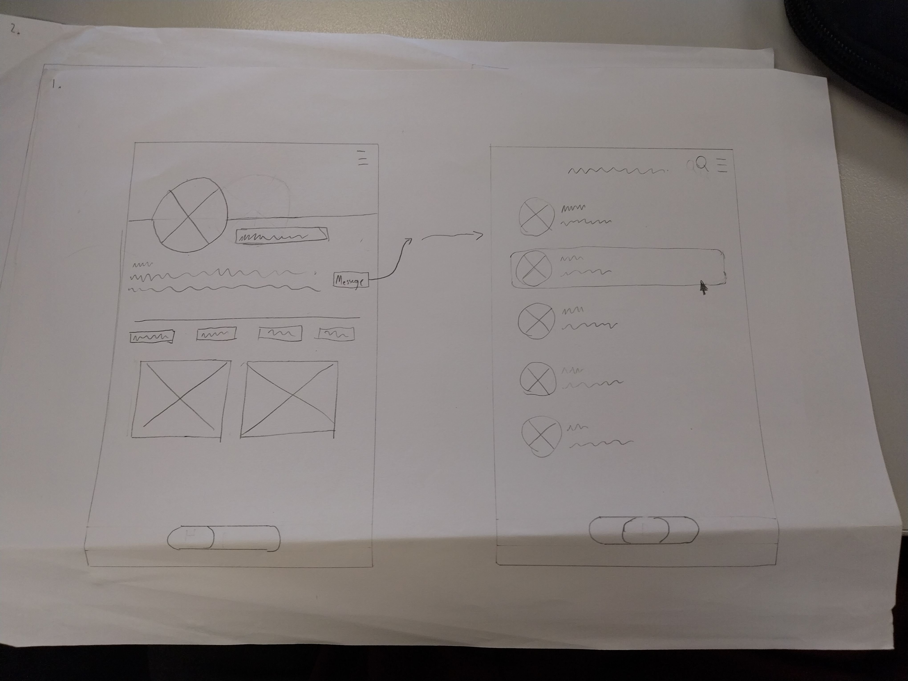
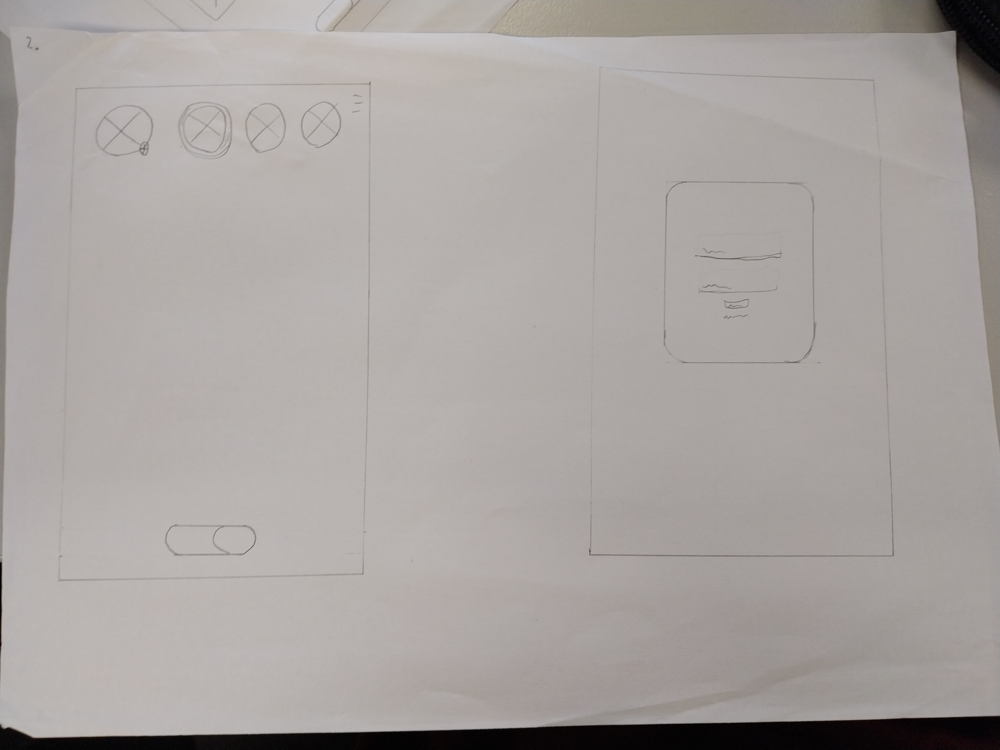

# hello-world-real

### **Important** How to run application

- download main branch as a zip file
- extract zip file to VS Code
- press 'ctrl' + '`' to open terminal
- open a new bash terminal and run 'python main.py'

User details
Username: final
Password: final

Username: cheese
Password: cheese

You can also sign up a new account

### Project Description

# A messaging platform simililar in functionality to instagram

3 pages
Homepage/FYP
Messaging
Profile

| Functional Requirements                                          | Non Functional Requirements               |
| ---------------------------------------------------------------- | ----------------------------------------- |
| Navigate between pages using links/buttons                       | Acceptable load times (1 second)          |
| Login functionality                                              | Visually aesthetic                        |
| Send and save messages to a database which can then be retrieved | Streamlined ui for smooth user experience |
| Share images                                                     | Intuitive interface                       |

# Design decisions

- Minimalistic aesthetics (White,light colours)
- Rounded corners to give site polish
- legible, unadorned font,
- 1-2 font families

# Sketches/Wireframes




# Algorithms

Flow chart for Login Functionality


Test Case 1:

Test Case ID: 1
Test Case Name: User login functionality
Preconditions: User is registered on website, users data is recorded on database,
Test Steps:

- Open website
- Input details into relevant fields
- Press login button
  Expected Result: Succesfully logs in and unlocks website

Test Case 2:

Test Case ID: 2
Test Case Name: Message functionality
Preconditions: User is registered on website, users data is recorded on database, user is logged in
Test Steps:

- Log into website
- Open messages and select chat
- Input message
- Send message
- Log out

Expected result: Message is saved to chat and appears when recipitent logs in

Test Case 3:

Test Case ID: TC 003
Test Case Name: Change Bio
Preconditions: User is registered on website, users data is recorded on database, user is logged in
Test Steps:

- Log into website and navigate to profile page
- Click on edit bio button
- Input new bio
- Press save

Expected result: New bio is saved to backend and will remain upon logging out

## Database


- Data was generated using mockaroo.
- User and Chat ID columns are set to autoincrement, giving each user and chat a unique ID.

## Sql Queries

# Return all usernames and emails

1. ```
   { SELECT username, email FROM user_data; }
   ```

# Returns all messages sent by the user

2. ```
   { SELECT \* FROM messages WHERE sender = 'ricowang'; }
   ```

# Lists users by their account creation date in descending order

3. ```
   {SELECT username, account_creation_date FROM user_data ORDER BY account_creation_date DESC; }
   ```

# Combines data from both tables to show messages sent to 'ricowang', along with sender info.

4. ```
   { SELECT u.username, m.content, m.timestamp FROM user_data u JOIN messages m ON u.username = m.sender WHERE m.recipient = 'ricowang';' }
   ```

# Counts how many messages each sender has sent.

5. ```
   { SELECT sender, COUNT(\*) AS message_count FROM messages GROUP BY sender ORDER BY message_count DESC; }
   ```

## Webpage design and functionality

-My original wireframes were more gear towards a mobile app, whereas the actual product is a webapp, developed mainly for pc, meaning I changed some aesthetic features such as the layout of the chat, and the navigation bar, due to it not having to be at the bottom of the screen near the thumb.

# Functionality and Interactivity:

Test cases 1 through 3 all worked after several attempt and minor improvements

# Login page


- Input data into relevant fields and press login to unlock the website and things unique to your account
- Inputting the wrong username or password will deny access to the site.

# Signup page


- Input an unused username, email and password to create an account
- Automatically sets you a default avatar and bio, and records account creation date, email and password.
- Unlocks site.

# Profile Page


-Displays avatar, which can be editted by uplading your own img

- Displays username
- Displays bio, which can be edited and saved

# Messages page


- Select users to message on the lefthand side
- Search for users using the search bar
- Input a message and press send to save it to the sql database
- Recieve messages from other users
- Chats are shown in order of last interacted with (messages sent or received)

## Lighthouse reports and Optimisation

# Before

One of my original issues


In this case, the problem was solved by editing the css, making the message bubble text darker, and making the light blue a slightly darker pink
The second issue was resolved by setting the default language of each html page to english

# After

 
In fixing it some other minor issues came up, these were solved one by one to make progress. (One issue required me simply creating an 'app.js' file in the 'js' directory)


# After after


the missing 4 from best practises is due to not using any placeholders for the posts "

